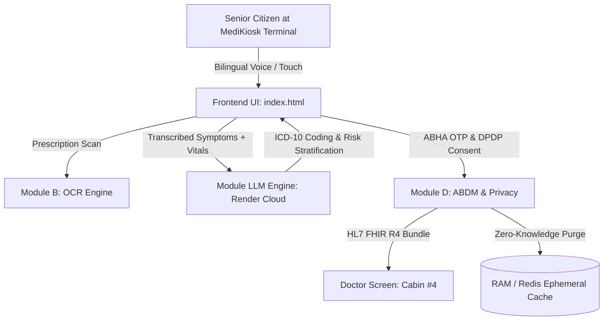

# MediKiosk Smart OPD & AyurKiosk Triage (SIH26047)

An AI-powered, senior-friendly smart OPD triage terminal integrating multi-modal patient voice intake, prescription OCR digitization, clinical LLM synthesis, ABDM / ABHA authentication, and DPDP Act 2023 compliant privacy.

---

## 🚀 Live Production Deployments

| Component | Status | Live Production URL | Documentation |
|:---|:---:|:---|:---|
| **Cloud AI Backend (Render)** | 🟢 Online | [`https://team-aces-sih.onrender.com`](https://team-aces-sih.onrender.com) | [Swagger UI (`/docs#`)](https://team-aces-sih.onrender.com/docs#/) • [Health Probe](https://team-aces-sih.onrender.com/health) |
| **Primary LLM Inference API** | 🟢 Active | [`POST /api/v1/llm/process`](https://team-aces-sih.onrender.com/api/v1/llm/process) | [ReDoc (`/redoc`)](https://team-aces-sih.onrender.com/redoc) |
| **MediKiosk Web Frontend** | 🟢 Ready | [`index.html`](index.html) | [GitHub Pages / Vercel / Netlify](#-frontend-deployment-guide) |

---

## 🌟 Key Architecture & Capabilities



1. **Senior-Friendly Kiosk Intake (`index.html`)**:
   - Ultra-clear typography, warm organic botanical palette, and minimum 56px+ touch targets.
   - Built-in Web Speech API (speech recognition in Hindi/English and text-to-speech voice guidance).
   - Direct integration with `https://team-aces-sih.onrender.com/api/v1/llm/process`.

2. **Dual-Model Clinical Intelligence (`module_llm_engine`)**:
   - Orchestrates Google Gemini (`gemini-2.5-flash`) with automatic OpenAI fallback.
   - Extracts chief complaints, clinical symptoms, standardized ICD-10 codes, triage risk score (1–10), and patient-friendly advice.

3. **ABDM & DPDP Privacy Framework (`module_d_abdm_privacy`)**:
   - ABHA OTP verification and demographic profile extraction (Ramesh Kumar, Token #42).
   - HL7 FHIR R4 Document Bundle converter (`Bundle` of type `document` with `Composition`, `Patient`, `Condition`, `MedicationStatement`, and `Observation`).
   - Strict 15-minute auto-expiry (TTL = 900s) and instant zero-knowledge post-consultation data purging.

---

## 🖥️ Frontend Deployment Guide

The frontend is a fully responsive Single Page Application (`index.html`) with zero build steps required.

### Option 1: GitHub Pages (Automatic with GitHub Actions)
1. Go to your GitHub repository: **Settings > Pages**.
2. Under **Build and deployment > Source**, select **GitHub Actions**.
3. Push to `main` — the workflow `.github/workflows/deploy-pages.yml` will automatically build and publish the frontend at:
   `https://shivangi-singh18.github.io/Team-Aces-SIH/`

### Option 2: 1-Click Vercel Deployment
1. Import `Shivangi-singh18/Team-Aces-SIH` on [Vercel](https://vercel.com).
2. Framework Preset: **Other** (Root directory: `.`).
3. Click **Deploy**. The `vercel.json` configuration handles static routing automatically.

### Option 3: Netlify Deployment
1. Connect your repository on [Netlify](https://netlify.com).
2. Publish directory: `.` (managed via `netlify.toml`).
3. Click **Deploy Site**.

### Option 4: Render Static Site
1. On your Render dashboard, click **New + > Static Site**.
2. Connect `Shivangi-singh18/Team-Aces-SIH`.
3. Publish directory: `.`.

---

## 🧪 Testing the Live Backend Endpoint

### cURL
```bash
curl -X POST "https://team-aces-sih.onrender.com/api/v1/llm/process" \
  -H "Content-Type: application/json" \
  -d '{
    "voice_transcript": "Three days of high fever and severe chest tightness",
    "patient_demographics": {
      "name": "Ramesh Kumar",
      "age": 60,
      "gender": "Male"
    }
  }'
```

### PowerShell
```powershell
Invoke-RestMethod -Uri "https://team-aces-sih.onrender.com/api/v1/llm/process" `
  -Method Post `
  -ContentType "application/json" `
  -Body '{"voice_transcript":"Three days of high fever and severe chest tightness"}'
```

---

## 📁 Repository Layout

```
Team-Aces-SIH/
├── index.html                                # Unified MediKiosk Kiosk Frontend (Live on Render)
├── vercel.json                              # Vercel deployment configuration
├── netlify.toml                             # Netlify deployment configuration
├── .github/workflows/deploy-pages.yml       # GitHub Pages automated deployment
├── module_llm_engine/                       # LLM Orchestration Engine (Deployed on Render)
│   ├── main.py                              # FastAPI backend
│   ├── llm_processor.py                     # Gemini & OpenAI core
│   └── schemas.py                           # Pydantic v2 data contracts
├── module_d_abdm_privacy/                   # ABDM, FHIR R4 & DPDP Privacy
│   ├── abdm_client.py                       # ABHA OTP & Consent Artefacts
│   ├── fhir_converter.py                    # HL7 FHIR R4 Bundle Converter
│   ├── session_manager.py                   # Redis + In-Memory TTL & Purge
│   └── router.py                            # FastAPI APIRouter endpoints
├── module_b_ocr/                            # Document OCR & entity extractor
└── stitch_medikiosk_smart_opd_triage/       # UI screens & design tokens
```