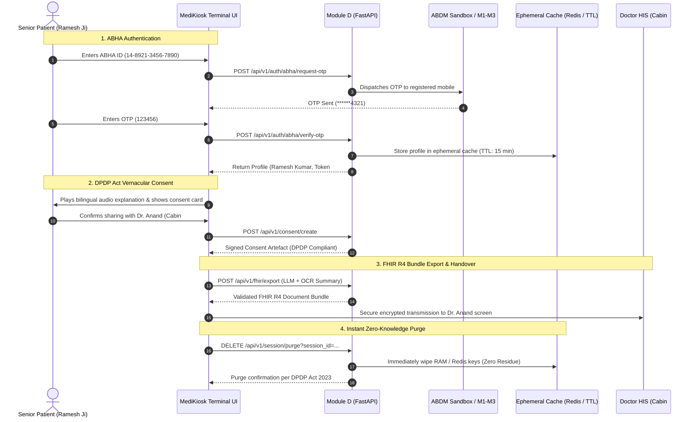

# Module D: ABDM Integration, FHIR R4 Bundling, Consent & DPDP Privacy

Production-grade, hackathon-optimized backend module for **MediKiosk Smart OPD (SIH26047)** providing:
1. **ABDM / ABHA Sandbox Authentication**: OTP generation and verification for patient identity.
2. **Consent Management with DPDP Act 2023 Compliance**: Time-bounded, purpose-limited consent artefacts.
3. **HL7 FHIR R4 Document Bundle Conversion**: Standardized electronic health records synthesizing patient voice intake, digitized OCR reports, and AYUSH Prakriti/Vikriti notes.
4. **Ephemeral Session Management**: 15-minute auto-expiring cache (Redis with in-memory TTL fallback) and instant zero-knowledge post-consultation data purging.

---

## Architecture & Data Flow



---

## DPDP Act 2023 Compliance Matrix

| Statutory Mandate (DPDP Act 2023) | Module D Implementation |
| :--- | :--- |
| **Section 5: Notice & Purpose Limitation** | Granular notice rendered in Hindi and English; data strictly bound to immediate OPD consultation in Cabin #4. |
| **Section 6: Explicit Consent** | ABDM Consent Manager artefact with explicit HI types (`Prescription`, `DiagnosticReport`, `OPConsultation`). |
| **Section 8: Minimal Retention & Erasure** | Strict 15-minute auto-expiry (TTL = 900s) with instantaneous purging via `DELETE /api/v1/session/purge`. |
| **Zero-Knowledge Ephemeral RAM** | No persistent patient records written to SQL/disk. All tokens stored in volatile Redis/RAM. |
| **Right to Revoke / Withdraw** | Real-time toggle switch on kiosk UI immediately aborts transmission. |

---

## Module Directory Structure

```
module_d_abdm_privacy/
├── __init__.py            # Package exports
├── abdm_client.py         # Mock & Sandbox ABDM APIs (OTP, Profile, Consent)
├── fhir_converter.py      # HL7 FHIR R4 Document Bundle synthesizer
├── session_manager.py     # Redis + In-Memory TTL ephemeral storage
├── router.py              # FastAPI APIRouter endpoints
├── schemas.py             # Strict Pydantic v2 data contracts
├── main.py                # Standalone microservice entrypoint
├── requirements.txt       # Dependencies
├── README.md              # Documentation & wiring guide
└── tests/
    ├── __init__.py
    ├── test_abdm_client.py
    ├── test_fhir_converter.py
    ├── test_session_manager.py
    └── test_router.py
```

---

## Quickstart & Running the Microservice

### 1. Install Dependencies
```bash
pip install -r module_d_abdm_privacy/requirements.txt
```

### 2. Launch Standalone Server (Port 8003)
```bash
uvicorn module_d_abdm_privacy.main:app --host 0.0.0.0 --port 8003 --reload
```

Interactive OpenAPI documentation is available at:
- **Swagger UI**: `http://localhost:8003/docs`
- **ReDoc**: `http://localhost:8003/redoc`

---

## API Endpoints Reference & Testing Guide

### 1. Request ABHA OTP
**Endpoint**: `POST /api/v1/auth/abha/request-otp`

```bash
curl -X POST "http://localhost:8003/api/v1/auth/abha/request-otp" \
  -H "Content-Type: application/json" \
  -d '{
    "abha_id": "14-8921-3456-7890"
  }'
```

**Response (`200 OK`)**:
```json
{
  "success": true,
  "txn_id": "txn-a49e218c39de",
  "message": "OTP sent successfully to registered mobile number.",
  "message_hi": "पंजीकृत मोबाइल नंबर पर 6-अंकों का ओटीपी भेजा गया है।",
  "masked_mobile": "******7890",
  "expires_in_seconds": 600
}
```

---

### 2. Verify ABHA OTP
**Endpoint**: `POST /api/v1/auth/abha/verify-otp`

> **Note**: For sandbox and testing, default OTP is `123456`.

```bash
curl -X POST "http://localhost:8003/api/v1/auth/abha/verify-otp" \
  -H "Content-Type: application/json" \
  -d '{
    "abha_id": "14-8921-3456-7890",
    "otp": "123456",
    "txn_id": "txn-a49e218c39de"
  }'
```

**Response (`200 OK`)**:
```json
{
  "success": true,
  "profile": {
    "abha_number": "14-8921-3456-7890",
    "abha_address": "ramesh.kumar@abdm",
    "name": "Ramesh Kumar",
    "gender": "M",
    "dob": "1965-04-12",
    "mobile": "+91-98765-43210",
    "address": {
      "line": "Ward 4, Civil Lines",
      "district": "Jaipur",
      "state": "Rajasthan",
      "pincode": "302001"
    },
    "photo_url": null,
    "kyc_verified": true
  },
  "access_token": "abdm_x_token_e992b10a248f",
  "session_id": "kiosk_sess_38a9bc0192e4",
  "message": "ABHA identity verified successfully."
}
```

---

### 3. Create ABDM Consent Artefact (DPDP Act 2023)
**Endpoint**: `POST /api/v1/consent/create`

```bash
curl -X POST "http://localhost:8003/api/v1/consent/create" \
  -H "Content-Type: application/json" \
  -d '{
    "abha_id": "14-8921-3456-7890",
    "scope": ["Prescription", "DiagnosticReport", "OPConsultation"],
    "hiu_id": "MEDIKIOSK_OPD_01",
    "purpose": "CARETREE",
    "doctor_name": "Dr. Anand",
    "cabin_number": "Cabin #4"
  }'
```

**Response (`201 Created`)**:
```json
{
  "success": true,
  "consent_id": "consent-7994821a-45c1-4ba2-8d77-628d003e4811",
  "consent_artefact": {
    "consent_id": "consent-7994821a-45c1-4ba2-8d77-628d003e4811",
    "status": "GRANTED",
    "created_at": "2026-09-09T10:15:00Z",
    "patient_abha_id": "14-8921-3456-7890",
    "hiu": {
      "id": "MEDIKIOSK_OPD_01",
      "name": "MediKiosk Smart OPD Terminal"
    },
    "requester": {
      "name": "Dr. Anand",
      "cabin": "Cabin #4",
      "identifier": {
        "type": "REGNO",
        "value": "MCI-48291",
        "system": "https://nmc.org.in"
      }
    },
    "hi_types": ["Prescription", "DiagnosticReport", "OPConsultation"],
    "permission": {
      "access_mode": "VIEW",
      "data_erase_at": "2026-09-09T10:30:00Z"
    },
    "dpdp_compliance": {
      "regulation": "Digital Personal Data Protection Act, 2023 (DPDP Act 2023)",
      "notice_displayed_in_vernacular": true,
      "purpose_limitation": "Immediate clinical consultation at Cabin #4 with Dr. Anand.",
      "ephemeral_processing": true,
      "retention_policy": "Zero-knowledge immediate purge upon consultation handover or 15-minute auto-expiry.",
      "patient_right_to_withdraw": true
    }
  },
  "message": "Consent artefact recorded and active under DPDP Act 2023 regulations."
}
```

---

### 4. Export to HL7 FHIR R4 Document Bundle
**Endpoint**: `POST /api/v1/fhir/export`

```bash
curl -X POST "http://localhost:8003/api/v1/fhir/export" \
  -H "Content-Type: application/json" \
  -d '{
    "summary_payload": {
      "chief_complaints": ["Acute chest tightness", "Fatigue"],
      "patient_symptoms": ["Exertional dyspnea", "Excessive thirst"],
      "medical_history_summary": "60-year-old male with long-standing Type-2 Diabetes on Metformin.",
      "diagnoses": ["Type 2 Diabetes Mellitus", "Essential Hypertension"],
      "icd10_codes": [
        {"code": "E11.9", "description": "Type 2 diabetes mellitus without complications"},
        {"code": "I10", "description": "Essential (primary) hypertension"}
      ],
      "medications": [
        {"drug_name": "Amlodipine", "dosage": "5mg", "frequency": "1-0-0", "duration": "30 days"},
        {"drug_name": "Metformin", "dosage": "500mg", "frequency": "1-0-1", "duration": "30 days"}
      ],
      "lab_results": [
        {"test_name": "Fasting Blood Sugar", "value": "158", "unit": "mg/dL", "is_abnormal": true, "reference_range": "70-99 mg/dL"}
      ],
      "vitals": {
        "systolic_bp": 138,
        "diastolic_bp": 88,
        "heart_rate": 78,
        "spo2": 98,
        "temperature_f": 98.6
      },
      "ayush_notes": {
        "prakriti": "Vata-Pitta",
        "vikriti": "Pitta imbalance",
        "lifestyle_recommendations": ["Drink warm cumin water", "Avoid oily snacks"]
      },
      "risk_assessment": {
        "risk_level": "Medium",
        "score": 5,
        "recommended_specialty": "General Medicine"
      }
    },
    "abha_profile": {
      "abha_number": "14-8921-3456-7890",
      "name": "Ramesh Kumar",
      "gender": "M",
      "dob": "1965-04-12",
      "mobile": "+91-98765-43210"
    }
  }'
```

**Response (`200 OK`)**:
Returns an HL7 FHIR R4 Bundle where:
- `bundle.type` = `"document"`
- `bundle.entry[0].resource.resourceType` = `"Composition"` (with LOINC `34133-9` and sections for Complaints, HPI, Diagnoses, Medications, Labs, Vitals, AYUSH Prakriti, and Triage).
- `bundle.entry[1].resource.resourceType` = `"Patient"` (with ABHA identifier `https://healthid.ndhm.gov.in`).
- Followed by `Condition`, `MedicationStatement`, and `Observation` resources.

---

### 5. Immediate Post-Consultation Purge (DPDP Compliance)
**Endpoint**: `DELETE /api/v1/session/purge?session_id=kiosk_sess_38a9bc0192e4`

```bash
curl -X DELETE "http://localhost:8003/api/v1/session/purge?session_id=kiosk_sess_38a9bc0192e4"
```

**Response (`200 OK`)**:
```json
{
  "success": true,
  "session_id": "kiosk_sess_38a9bc0192e4",
  "message": "Patient data successfully wiped with zero residue in strict compliance with DPDP Act 2023.",
  "purged_at": "2026-09-09T10:25:30.123456+00:00"
}
```

---

## Wiring into `stitch_medikiosk_smart_opd`

The frontend consent and routing screen in `stitch_medikiosk_smart_opd_triage/calm_spacious_consent_routing/code.html` can be wired to Module D with standard JavaScript `fetch()` calls.

### Client Integration Code:

```javascript
// Configuration (Production Render Cloud or Local Dev)
const API_BASE_URL = window.location.hostname === "localhost" || window.location.hostname === "127.0.0.1"
  ? "http://localhost:8000/api/v1"
  : "https://team-aces-sih.onrender.com/api/v1";
const MODULE_D_BASE_URL = window.location.hostname === "localhost" || window.location.hostname === "127.0.0.1"
  ? "http://localhost:8003/api/v1"
  : "https://team-aces-sih.onrender.com/api/v1";

// 1. Authenticate Patient via ABHA OTP
async function loginWithABHA(abhaId, otp = "123456") {
  // Step A: Request OTP
  const otpRes = await fetch(`${MODULE_D_BASE_URL}/auth/abha/request-otp`, {
    method: "POST",
    headers: { "Content-Type": "application/json" },
    body: JSON.stringify({ abha_id: abhaId })
  });
  const otpData = await otpRes.json();

  // Step B: Verify OTP
  const verifyRes = await fetch(`${MODULE_D_BASE_URL}/auth/abha/verify-otp`, {
    method: "POST",
    headers: { "Content-Type": "application/json" },
    body: JSON.stringify({
      abha_id: abhaId,
      otp: otp,
      txn_id: otpData.txn_id
    })
  });
  const authData = await verifyRes.json();
  
  // Store session_id in sessionStorage (ephemeral browser session)
  sessionStorage.setItem("kiosk_session_id", authData.session_id);
  sessionStorage.setItem("abha_profile", JSON.stringify(authData.profile));
  return authData;
}

// 2. Wire the Consent Switch & Action Button
document.addEventListener("DOMContentLoaded", () => {
  const proceedBtn = document.getElementById("primary-proceed-btn");
  const consentSwitch = document.getElementById("consent-switch");

  if (proceedBtn) {
    proceedBtn.addEventListener("click", async () => {
      const sessionId = sessionStorage.getItem("kiosk_session_id");
      const isConsentGranted = consentSwitch ? consentSwitch.checked : true;

      if (isConsentGranted) {
        // Step 1: Create DPDP-compliant Consent Artefact
        const consentRes = await fetch(`${MODULE_D_BASE_URL}/consent/create`, {
          method: "POST",
          headers: { "Content-Type": "application/json" },
          body: JSON.stringify({
            abha_id: "14-8921-3456-7890",
            scope: ["Prescription", "DiagnosticReport", "OPConsultation"],
            doctor_name: "Dr. Anand",
            cabin_number: "Cabin #4"
          })
        });
        const consent = await consentRes.json();
        console.log("Consent recorded:", consent.consent_id);

        // Step 2: Export FHIR R4 Bundle to Doctor HIS Screen
        // (Combines voice summary + OCR prescription data)
        const summaryData = JSON.parse(sessionStorage.getItem("clinical_summary") || "{}");
        const profile = JSON.parse(sessionStorage.getItem("abha_profile") || "{}");

        const fhirRes = await fetch(`${MODULE_D_BASE_URL}/fhir/export`, {
          method: "POST",
          headers: { "Content-Type": "application/json" },
          body: JSON.stringify({
            summary_payload: summaryData,
            abha_profile: profile,
            session_id: sessionId
          })
        });
        const fhirBundle = await fhirRes.json();
        console.log("FHIR Document Bundle dispatched to Cabin #4:", fhirBundle.bundle_id);
      }

      // Step 3: Zero-Knowledge Purge of Kiosk Terminal (DPDP Act Compliance)
      if (sessionId) {
        await fetch(`${MODULE_D_BASE_URL}/session/purge?session_id=${sessionId}`, {
          method: "DELETE"
        });
        sessionStorage.clear();
        console.log("Kiosk patient session securely purged.");
      }

      alert("डॉ. आनंद केबिन #4 में आपका स्वागत है। आपका सारांश सुरक्षित रूप से साझा कर दिया गया है।");
    });
  }
});
```

---

## Running Unit Tests

Execute the automated test suite covering ABDM client, FHIR converter, session manager, and API routes:

```bash
pytest module_d_abdm_privacy/tests/ -v
```

